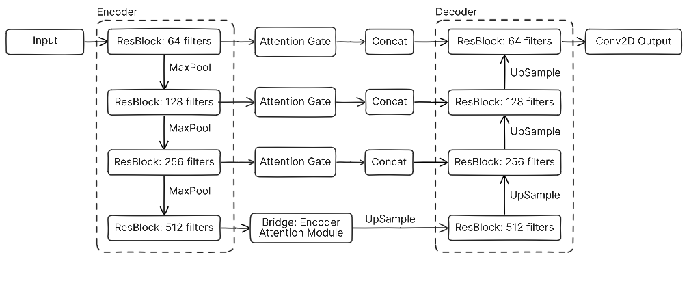
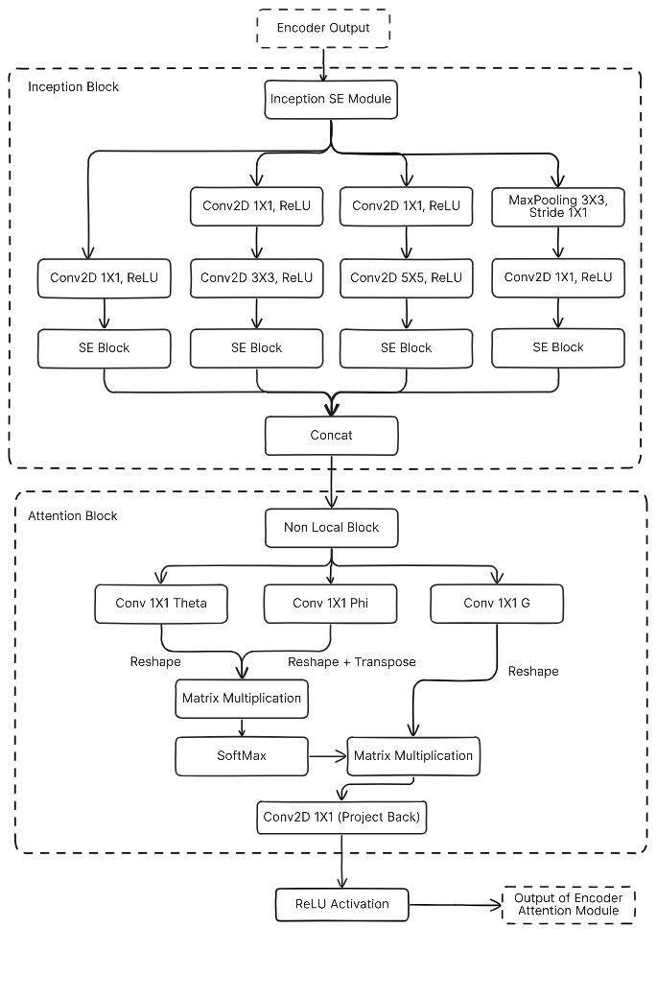

# SENLA-ResUNet: Hybrid Residual U-Net with Attention for Nuclei Segmentation  

🚀 **SENLA-ResUNet** is a novel deep learning architecture designed for **accurate nuclei segmentation** in biomedical images.  
It enhances the standard Residual U-Net by incorporating **multi-scale feature extraction, channel-wise recalibration, and global attention mechanisms**, achieving **state-of-the-art performance** on challenging datasets like **DSB2018** and **TNBC**.  

📄 Reference: [Research Paper](./SENLA_ResUNet__A_Hybrid_Residual_U_Net_with_Squeeze_Excitation_and_Non_Local_Attention_for_Accurate_Nuclei_Segmentation.pdf)  

---

## ✨ Key Features
- 🔹 **Residual U-Net Backbone** – deep encoder-decoder with residual blocks for better gradient flow.  
- 🔹 **Encoder Attention Module** – combines multi-scale Inception-SE blocks with **Non-Local Attention**.  
- 🔹 **Squeeze-and-Excitation (SE) blocks** – adaptively recalibrate feature channels.  
- 🔹 **Attention Gates in Skip Connections** – filter irrelevant features and focus on salient regions.  
- 🔹 **Global Context Awareness** – captures long-range dependencies for robust boundary delineation.  

---

## 🏗️ Architecture Overview  

### 🔹 Overall SENLA-ResUNet  
<p align="center">  
    
</p>  

### 🔹 Encoder Attention Module  
<p align="center">  
    
</p>  

---

## 📊 Results  

### DSB-2018 Dataset
| Method         | IoU    | Dice  | Precision | Recall | Accuracy |
|----------------|--------|-------|-----------|--------|----------|
| U-Net          | 0.7277 | 0.7793 | 0.8775    | 0.8057 | 0.9650   |
| ResUNet        | 0.7871 | 0.8014 | 0.8631    | 0.8991 | 0.9710   |
| Attention U-Net| 0.7688 | 0.7972 | 0.8447    | 0.8967 | 0.9680   |
| Cellpose       | 0.6972 | 0.8166 | 0.8736    | 0.7747 | 0.8623   |
| **SENLA-ResUNet** | **0.7936** | **0.8172** | **0.8791** | **0.9084** | **0.9726** |

### TNBC Dataset
| Method         | IoU    | Dice  | Precision | Recall | Accuracy |
|----------------|--------|-------|-----------|--------|----------|
| U-Net          | 0.3876 | 0.4735 | 0.8386    | 0.4188 | 0.9085   |
| ResUNet        | 0.5145 | 0.6745 | 0.6657    | 0.6868 | 0.9096   |
| Attention U-Net| 0.4358 | 0.4577 | 0.4670    | 0.8706 | 0.8511   |
| Cellpose       | 0.7380 | 0.8117 | 0.8283    | 0.8696 | 0.8564   |
| **SENLA-ResUNet** | **0.8332** | **0.8986** | **0.9353** | **0.8822** | **0.9582** |

✅ SENLA-ResUNet sets a **new benchmark** with superior IoU, Dice, Precision, Recall, and Accuracy.  

---

## 📂 Dataset
- **[Data Science Bowl 2018 (DSB2018)](https://www.kaggle.com/competitions/data-science-bowl-2018/data)**  
- **[TNBC Nuclei Segmentation Dataset](https://zenodo.org/record/1175282)**  

All images are resized to **128×128** pixels for training.  

---

## ⚙️ Implementation Details
- Framework: **TensorFlow + Keras**  
- Optimizer: **Adam** (lr=1e-4)  
- Loss: **Binary Cross-Entropy**  
- Batch Size: **16**  
- Early stopping + checkpointing used.  
- Epochs: **20 max**  

---

## 🚀 Getting Started  

### Installation
```bash
git clone https://github.com/OVER-CODER/Nuclei-Segmentation.git
cd Nuclei-Segmentation
```

---

## 📌 Citation
If you use SENLA-ResUNet in your research, please cite:

```bibtex
@article{pandit2025senla,
  title={SENLA-ResUNet: A Hybrid Residual U-Net with Squeeze-Excitation and Non-Local Attention for Accurate Nuclei Segmentation},
  author={Pandit, Aryan and Mishra, Shivam and Vishwakarma, Amit and Kumar, Anil},
  year={2025},
  journal={arXiv preprint}
}
```